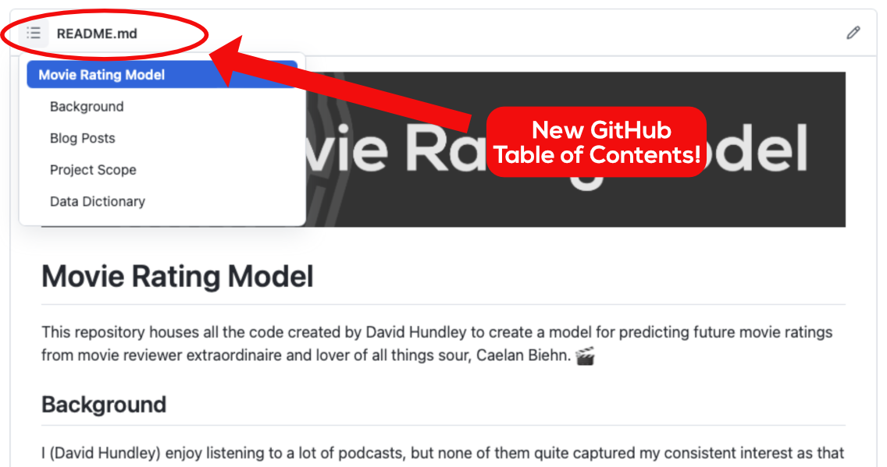
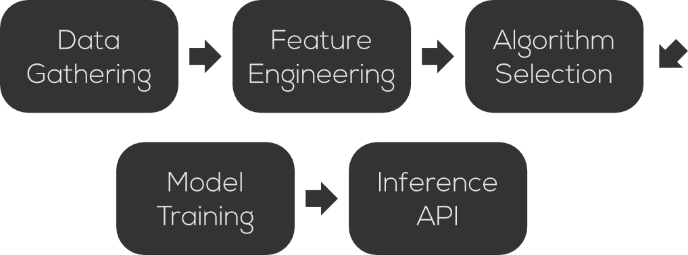

This repository houses all the code created by David Hundley to create a model for predicting future movie ratings from movie reviewer extraordinaire and lover of all things sour, Caelan Biehn. 🎬

(*Quick note!!* I used to have to build my own "Table of Contents" for READMEs, which, as many of you might be aware, was a long, arduous process. Thankfully, GitHub added new functionality in early 2021 that basically adds a Table of Contents for you based on your Markdown headers. The screenshot below shows how you can access this. Thank you, GitHub!)

# Background
I (David Hundley) enjoy listening to a lot of podcasts, but none of them quite captured my consistent interest as that of a podcast called **The Watercooler**. Aptly referred to once by somebody who shall remain unnamed (only because I forgot who), The Watercooler is very much the Seinfeld of podcasts: it's a podcast about... nothing! It's a time when five guys get together to talk about how their weeks are going, food, movies, cultural phenomenons, and more. The Watercooler has recurring bits, and one of these bits is a time in which the aforementioned Caelan Biehn will rate anything and everything, from grass (8.9) to the word "facetious" (9.4) to his own daughter (9.0). That's right, folks, the word "facetious" edged out his own daughter on this illustrious Biehn scale.

But by far, Caelan will use this time to rate movies. From the latest hits debuting on HBO Max to something that's probably going to have subtitles because it's not in English, Caelan provides two scores to a movie: one binary "yes/no" and another single decimal float between 0 and 10, aka the **Biehn Scale**. The Biehn Scale is a highly attuned scientific device. Its precision is so finely tuned that things rated on the Biehn scale shall never be updated. Our finest scientists still struggle to understand how the Biehn scale works. In late 2019, there was an accident at a lab where Mr. Biehn rated the movie *Alita: Battle Angel* a score of 8.6, but shortly thereafter Mr. Biehn gave the experience of watching *Alita: Battle Angel* in theaters a perfect 10 score. One of our brightest mind's head exploded when trying to hold this paradox in their head.

All silliness aside, I thought it would be fun to build a predictive model around Caelan's scores that he gives to movies. It also gave me a great excuse to go back and listen to their back catalog of podcasts, as I have now been collecting [all of Caelan's ratings in a Google Spreadsheet](https://docs.google.com/spreadsheets/d/1-8tdDUtm0iBrCdCRAsYCw2KOimecrHcmsnL-aqG-l0E/edit?usp=sharing). As of Sept. 2021, I still have a ways to go through the back catalog, but I think I have enough data now to build a twin set of predictive models to predict future movie scores from Caelan. This isn't meant to be a perfectly predictive set of models, but I thought it'd be fun!

**WOOF WOOF!**

# Blog Posts
This GitHub project is being supported by another of blog posts published in *Toward Data Science* on the Medium platform. For your convenience, I have linked to each of the respective posts in this series:

- [Part 1: Data Gathering!](https://towardsdatascience.com/creating-a-movie-rating-model-part-1-data-gathering-944bee6167c0)
- *Parts 2 and beyond coming in Q4 2021! (I hope!)*

# Project Scope

As noted in the background, Caelan provides two scores to his movie ratings:
- A binary "yes/no" approval
- A single decimal float between 0 and 10 (e.g. 4.3, 6.2)

To this end, we will be creating two models: a binary classification model to support the "yes/no" approval inference, and a regression model to support the 0-10 float score. We will not predetermine which algorithms we will be using as part of this project will be dedicated to proper algorithm selections.

Noted by the small graphic above, this project will take place in five parts. These parts are denoted as such:
- **Data Gathering**: This first part of the project will gather the data we need to support the project. This includes all of Caelan's review scores, which are self-populated via my own Google Sheet. All other supporting data will come from various data sources like APIs. (There is also one sub-part to this section where we will have to perform special screen scraping to get a particularly desired feature.)
- **Feature Engineering**: With our raw data gathering from the previous phase, we will engineer those features appropriately to use as inputs to our predictive algorithm. Because there are so many features, this section will likely come in two parts.
- **Algorithm Selection**: As noted above, we will test out a number of different algorithms as part of this phase to see which fares the best in terms of accuracy and performance. The algorithm selection will also include a piece to perform hyperparameter tuning for each of the respective algorithms.
- **Model Training**: Once we have determined which algorithms we will use for each of the respective predictive models, we will use this phase to create a formal model training pipeline, from start to finish. This is also equivalent to the automation of everything in previous three phases.
- **Inference API**: I would like to use this model to support other projects, so to help assist with that, we will be creating an inference API with these predictive models housed inside of it.

# Data Dictionary